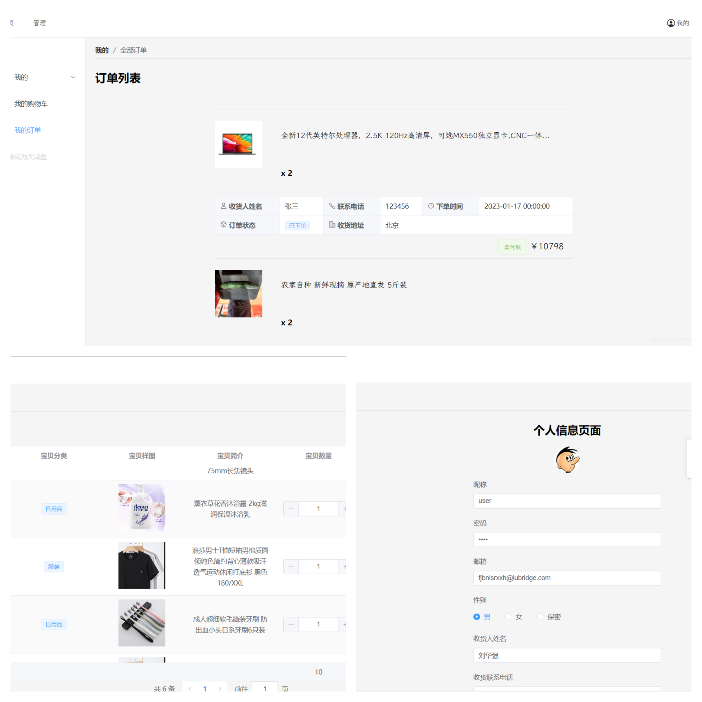

<!--
 * @Descripttion: 
 * @version: 
 * @Author: 王远昭
 * @Date: 2023-01-14 12:37:30
 * @LastEditors: 王远昭
 * @LastEditTime: 2023-01-30 13:51:27
-->
## 介绍

OnlineShopping 1.0是一套电商系统，包括  商城系统及 商城后台管理系统，基于后端技术 Flask 和 前端框架 Vue3.2 以及相关技术栈开发。 

###### 前台商城系统

- [x] 首页门户
- [x] 登陆注册
- [x] 商品分类
- [x] 商品轮播
- [x] 商品搜索
- [x] 商品展示
- [x] 购物车
- [x] 订单结算
- [x] 个人订单管理
- [ ] 会员中心
- [ ] 帮助中心

######  后台管理系统

- [x] 商品管理
- [ ] 数据面板
- [ ] 轮播图管理
- [ ] 订单管理
- [ ] 会员管理
- [ ] 分类管理
- [ ] 设置

本仓库中的源码为 xx 商城前后端分离版本的 Vue 项目（Vue 版本为 3.2），主要面向前端开发人员，

新蜂商城 Vue3 版本线上预览地址：[https://shop.wangwangyz.site](https://shop.wangwangyz.site)，账号可自行注册。

## 预览

#### 登陆注册模块

#### 首页商城

#### 商品分类

#### 商品管理

#### 会员中心

## 感谢

- [Vue](https://github.com/vuejs/core)
- [Vue-Router](https://github.com/vuejs/router)
- [ElementPlus](https://github.com/element-plus/element-plus)
